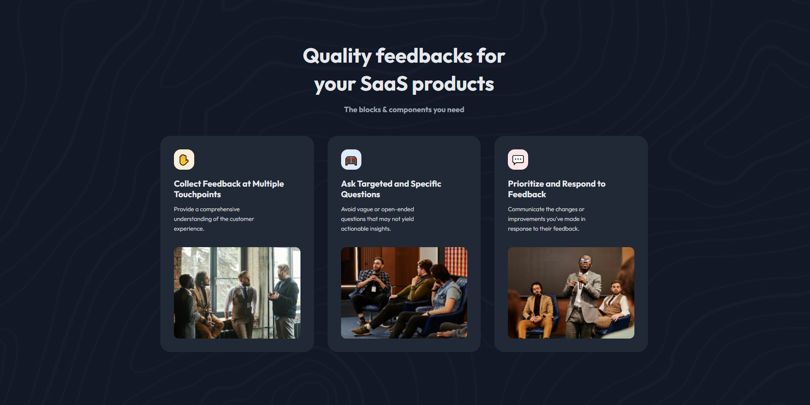

# Simple Feature Section

This is a solution to the [Simple Feature Section challenge on DevChallenges.io](https://devchallenges.io/). DevChallenges challenges help you improve your coding skills by building realistic projects.



## Overview

### The challenge

Users should be able to:

- View the optimal layout for the component depending on their device's screen size (mobile, tablet, desktop)
- See three distinct feedback collection cards with different approaches
- View a dark theme with custom background pattern

### Links

- Challenge URL: [devchallenges.io](https://devchallenges.io/challenge/simple-feature-section-challenge)
- Live Site URL: [simple-feature-section](https://simple-feature-section-challenge.surge.sh/)

## My process

### Built with

- Semantic HTML5 markup
- CSS Grid and Flexbox
- Mobile-first workflow
- [React](https://reactjs.org/) - JS library
- [TypeScript](https://www.typescriptlang.org/) - Type safety
- [Tailwind CSS](https://tailwindcss.com/) - For styling
- [Outfit](https://fonts.google.com/specimen/Outfit) - Google Font

### What I learned

This project helped me strengthen my skills in building responsive card layouts and working with dark themes. Here are some key takeaways:

#### Responsive Grid Layout with Tailwind

I implemented a responsive grid that adapts from 1 column on mobile to 3 columns on desktop:

```tsx
<div className="grid grid-cols-1 md:grid-cols-2 lg:grid-cols-3 gap-8">
  {data.map((item) => (
    <Card key={item.id} {...item} />
  ))}
</div>
```
